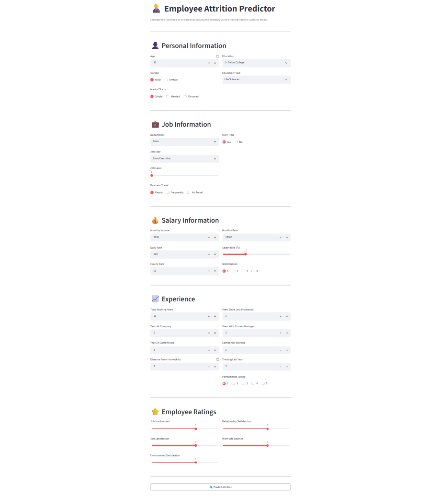
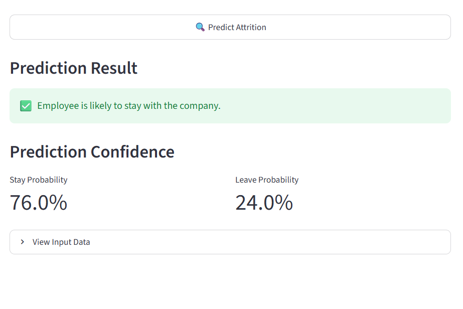

# 📊 Employee Attrition Prediction

An end-to-end Machine Learning project that predicts whether an employee is likely to leave a company based on HR analytics data. This project demonstrates the complete machine learning lifecycle, including SQL data analysis, data preprocessing, feature engineering, model training, evaluation, and deployment using Streamlit.

---

## 📖 Project Overview

Employee attrition is a major challenge for organizations as it impacts productivity, recruitment costs, and employee retention. This project uses Machine Learning to analyze employee-related factors and predict whether an employee is likely to leave the company.

The project demonstrates a complete end-to-end workflow, making it suitable as a portfolio project for Data Analyst and Machine Learning roles.

---

## ✨ Features

- 📂 Store and manage employee data using MySQL
- 📊 Perform SQL Exploratory Data Analysis (EDA)
- 🧹 Clean and preprocess employee data
- ⚙️ Build preprocessing pipelines using Scikit-learn
- 🤖 Train and evaluate Machine Learning models
- 💾 Save the best-performing model using Joblib
- 🌐 Deploy an interactive web application using Streamlit
- 🔐 Secure database credentials using `.env`
- 📁 Maintain a modular and organized project structure

---

## 🛠️ Tech Stack

- Python
- SQL
- MySQL
- Pandas
- NumPy
- Scikit-learn
- Streamlit
- SQLAlchemy
- Joblib
- Matplotlib
- Seaborn
- Git & GitHub
- Jupyter Notebook

---

## 📂 Dataset

This project uses the IBM HR Analytics Employee Attrition dataset.

The dataset contains employee demographic, job role, compensation, work experience and performance-related attributes used to predict employee attrition.

---

## 📂 Project Structure

```text

Employee-Attrition-Prediction
│
├── app/
│   └── app.py
│
├── assets/
│
├── data/
│
├── database/
│   ├── basic_validation.sql
│   ├── create_database.sql
│   ├── exploratory_queries.sql
│   └── schema_updates.sql
│
├── models/
│   ├── best_model.pkl
│   └── preprocessor.pkl
│
├── notebooks/
│   ├── 01_SQL_to_Pandas.ipynb
│   ├── 02_Data_Preprocessing.ipynb
│   └── 03_Model_Training_and_Evaluation.ipynb
│
├── src/
│   ├── config.py
│   └── database.py
│
├── .env
├── .gitignore
├── README.md
└── requirements.txt
```

---

## 🔄 Machine Learning Workflow

1. Data Collection
2. Database Creation (MySQL)
3. SQL Exploratory Data Analysis
4. Data Preprocessing
5. Feature Engineering
6. Model Training
7. Model Evaluation
8. Model Selection
9. Model Serialization
10. Streamlit Deployment

---

## 🤖 Model

The following machine learning algorithms were evaluated:

- Logistic Regression
- Decision Tree Classifier
- Random Forest Classifier

The Random Forest model achieved the best performance and was selected for deployment.

The trained model is saved as:

- `best_model.pkl`
- `preprocessor.pkl`

These are loaded directly into the Streamlit application for real-time predictions.

---

## 🌐 Streamlit Application

The application allows users to:

- Enter employee details
- Predict employee attrition
- View prediction confidence
- Review entered employee information

---

## 🚀 Installation

### 1. Clone the Repository

```bash
git clone https://github.com/Anshika-Gangwar/Employee-Attrition-Prediction.git
```

### 2. Navigate to the Project

```bash
cd Employee-Attrition-Prediction
```

### 3. Create a Virtual Environment

```bash
python -m venv venv
```

### 4. Activate the Virtual Environment

**Windows**

```bash
venv\Scripts\activate
```

**macOS / Linux**

```bash
source venv/bin/activate
```

### 5. Install Dependencies

```bash
pip install -r requirements.txt
```

### 6. Configure Environment Variables

Create a `.env` file:

```env
DB_HOST=localhost
DB_PORT=3306
DB_USER=your_username
DB_PASSWORD=your_password
DB_NAME=employee_attrition_db
```

### 7. Run the Streamlit Application

```bash
streamlit run app/app.py
```

## 🌐 Live Demo

🔗 **Streamlit Application:**  

https://employee-attrition-prediction-anshika.streamlit.app

---

## 📸 Application Preview

### Home Page



### Prediction Result


---

## 📈 Future Enhancements

- Deploy with Docker
- Add model explainability (SHAP)
- Build an HR analytics dashboard
- Add feature importance visualization
- Compare additional Machine Learning algorithms

---

## 👩‍💻 Author

**Anshika Gangwar**

Machine Learning | Python | SQL

GitHub:
https://github.com/Anshika-Gangwar

---

